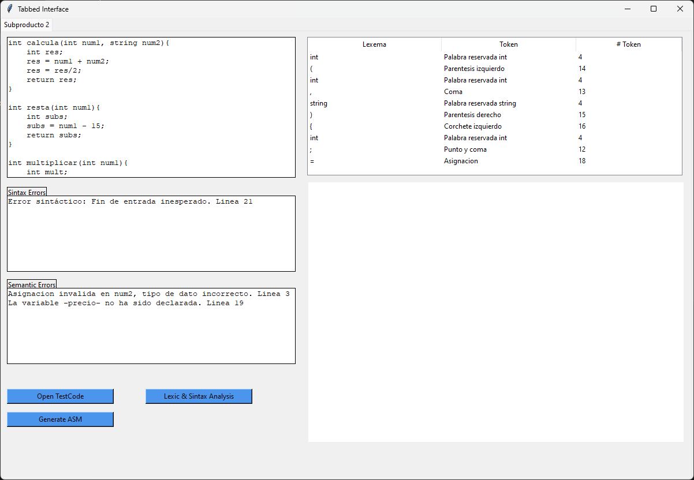

# Code-Analyzer-And-Assembler-Code-Generator
Code analyzer of a C, C++ test code and Assembler code generator

## ¿What it does? 🎯
* Lexical analysis
* Sintaxis analysis
* Semantic analysis
* Assembler code generator
* IU display of all the analysis information

## Modules used 🛠️
* Lexical an Sintaxis analysis
  - [PLY Lex-Yacc](https://www.dabeaz.com/ply/ply.html)
  - [re - Regular expressions](https://docs.python.org/3/library/re.html)
  - [enum - Support for enumerations](https://docs.python.org/3/library/enum.html)
* Interface
  - [Tkinter](https://docs.python.org/es/3/library/tkinter.html)

## Steps to use
1. Run the [main.py](https://github.com/Rafa-X/Code-Analyzer-And-Assembler-Code-Generator/blob/main/main.py)
2. Once in the interface, select **Open TestCode** and select the .txt that contains the code to analyze (try [testcode.txt](https://github.com/Rafa-X/Code-Analyzer-And-Assembler-Code-Generator/blob/main/testcode.txt))
3. Then select **Lexic & Sintax Analysis**, there are two ways that could procced:
    - If the code its OK, this will make the analysis and will draw the sintactical tree
    - If not, will show the errors, sintactical or semantical each in their own field
4. To generate the Assembler code of the test code, click on Generate ASM, the .asm will appear in the same location of the main.py

## Interface
### Run with no errors

  

### Run with errors
1. Change the parameter datatype of function **calcula()**, **int num2 -> string num2**
2. Delete the semicolon of the end in the first line of **main()** function
3. Delete the declaration of **promedio** variable in function **main()**

  

