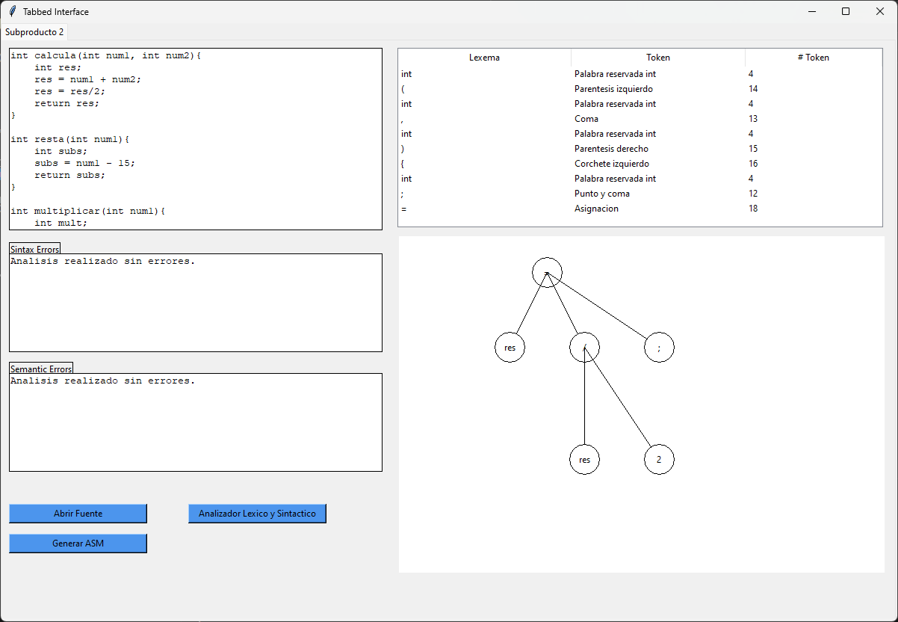

# Code-Analyzer-And-Assembler-Code-Generator
Code analyzer of a C, C++ test code and Assembler code generator

## ¿What it does? 🎯
* Lexical analysis
* Sintaxis analysis
* Semantic analysis
* Assembler code generator
* IU display of all the analysis information

## Modules used 🛠️
* Lexical an Sintaxis analysis
  - [PLY Lex-Yacc](https://www.dabeaz.com/ply/ply.html)
  - [re - Regular expressions](https://docs.python.org/3/library/re.html)
  - [enum - Support for enumerations](https://docs.python.org/3/library/enum.html)
* Interface
  - [Tkinter](https://docs.python.org/es/3/library/tkinter.html)

## Interface

  

